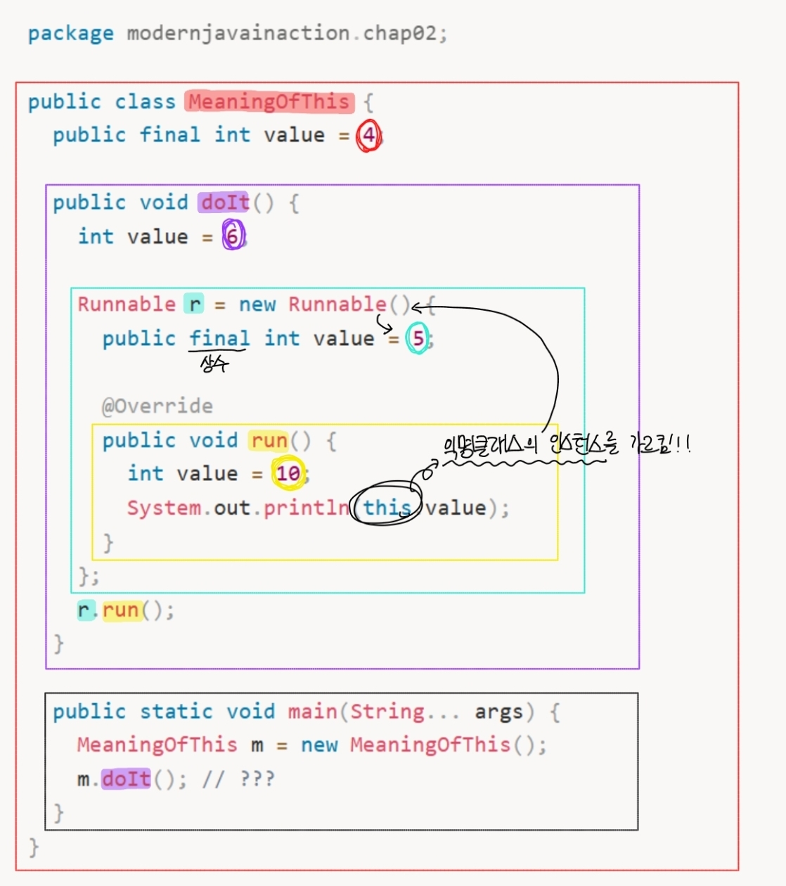

# [2장] 동작 파라미터화 코드 전달하기

💡 노션으로 더 가독성 좋게 확인 가능합니다! *([🔗노션 페이지에서 보기](https://app.notion.com/p/2-3bfc2d48bf0080089e78e0df35d0f177?pvs=21))*

### 2.0 서문

소비자 요구사항은 항상 바뀐다.

어제는 ‘녹색 사과 찾기’ 이었다가, 오늘은 ‘빨간 사과 찾기’가 될 수 있고, 내일은 ‘150g 넘는 사과 찾기’ 가 될 수도 있다.

이렇게 시시각각 변화하는 사용자 요구사항에 대응하기 위해 우리는 “동작 파라미터화”를 이용해야 한다.

#### 동작 파라미터화란?

> 아직은 어떻게 실행할 것인지 결정하지 않은 코드 블록.
> 
> 
> *EX) 나중에 실행될 메서드의 인수로 코드 블록 전달하기*
> 

*⇒ 자주 바뀌는 요구사항에 효과적으로 대응할 수 있다!*

## 2.1 변화하는 요구사항에 대응하기

### 2.1.1 첫 번째 시도 : 녹색 사과 필터링

```java
public static List<Apple> filterGreenApples(List<Apple> inventory) {
  List<Apple> result = new ArrayList<>();
  for (Apple apple : inventory) {
    if (apple.getColor() == Color.GREEN) {
      result.add(apple);
    }
  }
  return result;
}
```

하지만 이 방법으론 나중에 좀 더 다양한 색(옅은 녹색, 노란색 등)으로 필터링하는 변화에는 비슷한 코드를 쭉 나열해야 해서, 적절히 대응할 수 없다.

이렇게 거의 **비슷한 코드**가 반복 존재하는 문제가 발생한다면, **그 코드를 추상화**하여 해결한다!! *(→ 이어서 2.1.2 절에서 소개)*

### 2.1.2 두 번째 시도 : 색을 파라미터화

```java
public static List<Apple> filterApplesByColor(List<Apple> inventory, Color color) {
  List<Apple> result = new ArrayList<>();
  for (Apple apple : inventory) {
    if (apple.getColor() == color) {
      result.add(apple);
    }
  }
  return result;
}
```

```java
public static List<Apple> filterApplesByWeight(List<Apple> inventory, int weight) {
  List<Apple> result = new ArrayList<>();
  for (Apple apple : inventory) {
    if (apple.getWeight() > weight) {
      result.add(apple);
    }
  }
  return result;
}
```

위 코드도 좋은 해결책 이지만, **코드**가 **중복**된다는 문제가 있다.

이는 소프트웨어 공학의 **DRY**(같은 것을 반복하지 말 것) 원칙을 어기는 것!! *(→ 2.2절에서 해결 방법 소개)*

### 2.1.3 세 번째 시도 : 가능한 모든 속성으로 필터링

다음은 나쁨에도 불구하고 모든 속성을 메서드 파라미터로 추가한 모습이다.

```java
public static List<Apple> filterApples(List<Apple> inventory, Color color, int weight, boolean flag) {
  List<Apple> result = new ArrayList<>();
  for (Apple apple : inventory) {
    // flag가 true면 색상 필터링, false면 무게 필터링
    if ((flag && apple.getColor().equals(color)) ||
        (!flag && apple.getWeight() > weight)) {
      result.add(apple);
    }
  }
  return result;
}
```

이 매서드를 사용하면… 
  `filterApples(inventory, Color.RED, 0, true);` 
이렇게 호출해야 한다.

그럼 0과 true가 무엇을 의미하는지 파악하기 어려운 문제가 있다.

또한 요구사항이 바뀐다면 여러 중복된 필터 메서드를 만들거나, 모든 것을 처리하는 하나의 거대한 필터 메서드를 구현해야 한다.

이러한 문제점들이 있어서, 다음 절에서 **동작 파라미터화**를 이용해 유연성을 얻는 방법을 설명한다!

## 2.2 동작 파라미터화

- **동작 파라미터화**: 매서드가 다양한 동작을 **받아서** 내부적으로 다양한 동작을 **수행**
- **프레디케이트**(Predicate)
    - 참 또는 거짓을 반환하는 함수
    - 주로 인터페이스로 정의된다.
    - 응용: ApplePredicate는 사과 선택 전략(무게, 색 등)을 캡슐화

### 2.2.1 네 번째 시도 : 추상적 조건으로 필터링

```java
// 프레디케이트 인터페이스 선언
interface ApplePredicate {
  boolean test(Apple a);
}

// 동작 파라미터화를 적용한 필터 메서드
public static List<Apple> filter(List<Apple> inventory, ApplePredicate p) {
  List<Apple> result = new ArrayList<>();
  for (Apple apple : inventory) {
    if (p.test(apple)) { // 조건 검사를 프레디케이트 객체에 위임
      result.add(apple);
    }
  }
  return result;
}
```

우리가 전달한 ApplePredicate 객체(ex: AppleColorPredicate, AppleWeightPredicate)에 의해 filterApples 메서드의 동작이 결정된다.

⇒ filterApples 매서드의 동작을 파라미터화 한 것이다.

## 2.3 복잡한 과정 간소화

인터페이스를 구현하는 여러 클래스를 정의한 다음에 인스턴스화해야 한다.

→ 상당히 번거롭다

→ 그.래.서. **익명 클래스**를 활용한다.

### 2.3.1 익명 클래스

- 이름이 없는 클래스 이다.
- 클래스의 선언과 인스턴스화를 동시에 수행할 수 있다.

### 2.3.2 다섯 번째 시도 : 익명 클래스 사용

```java
List<Apple> redApples2 = filter(inventory, new ApplePredicate() {
  @Override
  public boolean test(Apple a) {
    return a.getColor() == Color.RED;
  }
});
```

- 익명 클래스 문제 p.80
    
    ```java
    package modernjavainaction.chap02;
    
    public class MeaningOfThis {
      public final int value = 4;
    
      public void doIt() {
        int value = 6;
        
        Runnable r = new Runnable() {
          public final int value = 5;
          
          @Override
          public void run() {
            int value = 10;
            System.out.println(this.value);
          }
        };
        r.run();
      }
    
      public static void main(String... args) {
        MeaningOfThis m = new MeaningOfThis();
        m.doIt(); // ???
      }
    }
    ```
    
    정답은 5
    
    
    
    익명 클래스 내부에서 사용된 `this` 키워드는 바깥쪽 래핑 클래스(MeaningOfThis)의 인스턴스를 가리키는 것이 아니라, 익명 클래스 Runnable 자체의 인스턴스를 가리킨다.
    
    왜? 익명 클래스는 ‘클래스의 선언과 인스턴스화를 동시에 수행’ 하기 때문에!!
    
    익명 클래스 내부에 인스턴스 변수 public final int value = 5;가 선언되어 있기 때문에, `this.value`를 출력하면 가장 바깥에 있는 4나 run() 메서드 안의 지역 변수 10이 아닌, 익명 클래스 멤버 변수인 5를 참조하게 됩니다.
    

하지만 여전히 단점이 있다…

1. 많은 공간을 차지한다.
2. ~~프로그래머가 익명 클래스 사용에 익숙하지 않다~~ → 요즘엔 해당 X

**람다 표현식**을 이용하면 코드를 간결히 정리할 수 있다.

### 2.3.3 여섯 번째 시도 : 람다 표현식 사용

```java
List<Apple> result = filterApples(inventory, (Apple, apple) -> RED.equals(apple.getColor()));
```

(3장에서 자세히 설명)

### 2.3.4 일곱 번째 시도 : 리스트 형식으로 추상화

형식 파라미터 T를 이용하여 사과뿐만 아니라 바나나, 오렌지, 정수, 문자열 등의 리스트 형식으로 추상화 가능하다.

```java
public interface Predicate<T> {
  boolean test(T t);
}

public static <T> List<T> filter(List<T> list, Predicate<T> p) {
  List<T> result = new ArrayList<>();
  for(T e : list) {
    if(p.test(e)) {
      result.add(e);
    }
  }
  return result;
}

// 사용 예시
List<Integer> evenNumbers = filter(numbers, (Integer i) -> i % 2 == 0);
```

단, T 제네릭은 남용하면 좋지 않다!! 자료형 추론이 불가능하기 때문에…

## 2.4 실전 예제

<aside>
👉

**동작 파라미터화 패턴**

1. 동작을 캡슐화한 다음에
2. 매서드로 전달해서
3. 매서드의 동작을 파라미터화 한다.
</aside>

### 2.4.1 Comparator로 정렬하기

sort의 동작을 파라미터화하여 사과의 무게를 기준으로 정렬할 수 있다.

```java
// 익명 클래스 사용
inventory.sort(new Comparator<Apple>() {
  public int compare(Apple a1, Apple a2) {
    return Integer.compare(a1.getWeight(), a2.getWeight());
  }
});

// 람다 사용
inventory.sort((Apple a1, Apple a2) -> Integer.compare(a1.getWeight(), a2.getWeight()));
```

### 2.4.2 Runnable로 코드 블록 실행하기

Runnable 인터페이스를 이용해서 실행할 코드 블록을 지정할 수 있다.

```java
// 익명 클래스 사용
Thread t = new Thread(new Runnable() {
  public void run() {
    System.out.println("Hello world");
  }
});

// 람다 사용
Thread t = new Thread(() -> System.out.println("Hello world"));
```

Q. 언제 쓰나요?

A. 자바에서는 백그라운드로 어떤 작업을 동시에 실행하고 싶을 때 스레드(Thread)를 사용한다!! 이때 스레드에게 "너가 구체적으로 어떤 일을 해야 할지" 알려주어야 하는데, 그 '할 일(동작)'을 포장해서 전달하는 규격(인터페이스)이 바로 Runnable이다.

→ 요약: Runnable 자체가 동작 파라미터화 이다.

### 2.4.3 Callable을 결과로 반환하기

Caalable 인터페이스를 이용해 결과를 반환하는 테스크를 만들 수 있다. *(Runnable의 업그레이드 버전이라 생각하면 편함)*

```java
ExecutorService executorService = Executors.newCachedThreadPool();

// 익명 클래스 사용
Future<String> threadName = executorService.submit(new Callable<String>() {
  @Override
  public String call() throws Exception {
    return Thread.currentThread().getName();
  }
});

// 람다 사용
Future<String> threadName = executorService.submit(() -> Thread.currentThread().getName());
```

자, 굳이굳이 차이점을 뽑자면..!

- **`Runnable`**: 코드를 실행만 하고 끝냄. **(결과 반환 X)**
- **`Callable`**: 코드를 실행한 후, 처리된 결과값을 돌려줌. **(결과 반환 O)**

### 2.4.4 GUI 이벤트 처리하기

- **GUI 프로그래밍**: 마우스 클릭, 문자열 위로 이동 등의 이벤트에 대응하는 프로그래밍

GUI 프로그래밍에서도 변화에 대응할 수 있는 유연한 코드가 필요하다!

```java
Button button = new Button("Send");

// 익명 클래스 사용
button.setOnAction(new EventHandler<ActionEvent>() {
  public void handle(ActionEvent event) {
    label.setText("Sent!!");
  }
});

// 람다 사용
button.setOnAction((ActionEvent event) -> label.setText("Sent!!"));
```

## 2.5 마치며

- **동작 파라미터화**란 메서드 내부적으로 다양한 동작을 수행할 수 있도록 아직 실행되지 않은 코드를 메서드 인수로 전달하는 기법이다.
- 동작 파라미터화를 이용하면 요구사항 변화에 더 유연하게 대응할 수 있고, 코드 중복을 최소화하여 엔지니어링 비용을 줄일 수 있다.
- 자바 API의 많은 메서드는 정렬(`Comparator`), 스레드(`Runnable`), GUI 이벤트 처리처럼 다양한 동작으로 파라미터화할 수 있으며, 익명 클래스나 람다를 사용해 간결하게 구현할 수 있다.