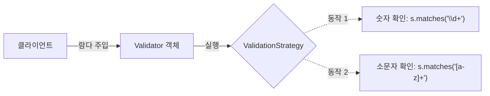
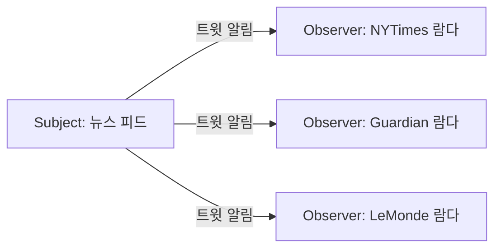
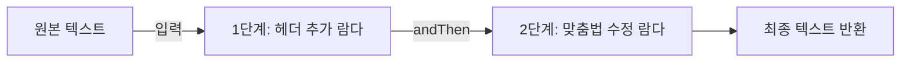

# [9장] 리펙터링, 테스팅, 디버깅

💡 노션에서 더 가독성 좋게 확인 가능합니다! *([🔗노션 페이지에서 보기](https://hyper-noise-b36.notion.site/9-3ebc2d48bf008005a76df50ab0f6acf7))*

<aside>
📖

9장에서는 람다, 메서드 참조, 스트림 기능을 이용한 리펙토링 방법에 대해 배운다!

</aside>

## 9.1 가독성과 유연성을 개선하는 리팩터링

### 9.1.1 코드 가독성 개선

Q. 코드 가독성 개선이란?

A. 우리가 구현한 코드를 다른 사람이 쉽게 이해하고 유지보수할 수 있게 만드는 것

### 9.1.2 익명 클래스를 람다 표현식으로 리팩토링하기

모든 익명 클래스를 람다 표현식으로 바꿀 수는 **없다**:

1. 익명 클래스에서 사용한 this와 super는 람다 표현식에서 다른 의미를 갖는다
2. 익명 클래스는 감싸고 있는 클래스의 변수를 가릴 수 있지만, 람다 표현식은 가릴 수 없다.
3. 익명 클래스는 인스턴스화 시 명시적으로 형식이 정해지지만, 람다의 형식은 콘텍스트에 따라 달라진다. 이로 인해 익명→람다 전환 시 콘텍스트 오버로딩에 다른 모호함이 남아 있다.

*→ 요즘에는 IDE 제공 리펙토링 기능 이용하면 이런 문제가 발생할 일은 없다.*

### 9.1.3 람다 표현식을 메서드 참조로 리펙토링하기

- 람다 표현식
    
    ```java
    // 칼로리 수준으로 요리를 그룹화 하는 코드
    Map<CaloricLevel, List<Dish>> dishesByCaloricLevel = menu.stream()
        .collect(groupingBy(dish -> dish.getCaloricLevel()));
    ```
    
- 메서드 참조
    
    ```java
    // 칼로리 수준으로 요리를 그룹화 하는 코드
    Map<CaloricLevel, List<Dish>> dishesByCaloricLevel = menu.stream()
        .collect(groupingBy(Dish::getCaloricLevel));
    ```
    

### 9.1.4 명령형 데이터 처리를 스트림으로 리팩토링하기

<aside>
➡️

~스트림 API 복습 시간~

- 스트림 API는 데이터 처리 파이프라인의 의도를 더 명확하게 보여준다.
- 장점 : 쇼트서킷, 게으름, 멀티코어 아키텍처 활용 가능
</aside>

- 명령형 데이터 처리
    
    ```java
    // 필터링과 추출 엉킨 코드
    List<String> dishNames = new ArrayList<>();
    for(Dish dish: menu) {
        if(dish.getCalories() > 300) {
            dishNames.add(dish.getName());
        }
    }
    ```
    
- 스트림 API
    
    ```java
    // 필터링과 추출 엉킨 코드
    List<String> dishNames = menu.stream()
        .filter(d -> d.getCalories() > 300)
        .map(Dish::getName)
        .collect(toList());
    ```
    

### 9.1.5 코드 유연성 개선

<aside>
➡️

~람다와 동작파라미터화 복습 시간~

- 람다 표현식을 이용하면 동작 파라미터화를 쉽게 구현할 수 있다!
- 실행 어라운드 : 3장에서 배운 준비-종료 과정을 람다로 표현해 재사용하는 패턴이다!
</aside>

람다 표현식을 사용하려면 함수형 인터페이스가 필요하다.

함수형 인터페이스 EX) 조건부 연기 실행, 실행 어라운드 패턴 등등…

> **조건부 연기 실행**
> 
> - 리펙토링 전 코드
>     
>     ```java
>     // 내장 자바 Logger 클래스 사용 코드
>     if (logger.isLoggable(Log.FINER)) {
>         logger.finer("Problem: " + generateDiagnostic());
>     }
>     ```
>     
> - 리펙토링 후 코드
>     
>     ```java
>     // 내장 자바 Logger 클래스 사용 코드
>     logger.finer(() -> "Problem: " + generateDiagnostic());
>     ```
>     
> 
> 클라이언트 코드에서 객체 상태를 자주 확인하거나,
> 객체의 일부 메서드를 호출하는 상황이라면
>         내부적으로 객체의 상태를 확인한 다음에 매서드를 호출하도록 
>         새로운 메서드를 구현하자.
>                 그러면 코드 가독성이 좋아지며, 
>                 캡슐화가 강화된다.
> 

> **실행 어라운드**
> 
> 
> ```java
> public String processFile(BufferedReaderProcessor p) throws IOException {
>     try (BufferedReader br = new BufferedReader(new FileReader("data.txt"))) {
>         return p.process(br);
>     }
> }
> 
> String oneLine = processFile((BufferedReader br) -> br.readLine());
> ```
> 

## 9.2 람다로 객체지향 디자인 패턴 리팩터링하기

- 디자인 패턴 : 공통적인 소프트웨어 문제를 설계할 때 재사용할 수 있는, 검즈오딘 청사진 제공
- 디자인 패턴 + 람다 표현식 : 전략, 템플릿 메서드, 옵저버, 의무 체인, 팩토리

### 9.2.1 전략

→ 한 유형의 알고리즘을 보유한 상태에서 / 런타임에 적절한 알고리즘을 선택하는 기법



```java
// 오직 소문자 또는 숫자로 이루어져야 하는 등 
// 텍스트 입력이 다양한 조건에 맞게 포맷 되어 있는지
// 검증하는 코드
interface ValidationStrategy {
    boolean execute(String s);
  }

  static private class IsAllLowerCase implements ValidationStrategy {
    @Override
    public boolean execute(String s) {
      return s.matches("[a-z]+");
    }
  }

  static private class IsNumeric implements ValidationStrategy {
    @Override
    public boolean execute(String s) {
      return s.matches("\\d+");
    }
  }

  static private class Validator {
    private final ValidationStrategy strategy;
    public Validator(ValidationStrategy v) {
      strategy = v;
    }
    public boolean validate(String s) {
      return strategy.execute(s);
    }
  }

  // old school
  Validator v1 = new Validator(new IsNumeric());
  System.out.println(v1.validate("aaaa"));
  Validator v2 = new Validator(new IsAllLowerCase());
  System.out.println(v2.validate("bbbb"));
```

↓ 람다표현식 사용 ↓

```java
// 오직 소문자 또는 숫자로 이루어져야 하는 등 
// 텍스트 입력이 다양한 조건에 맞게 포맷 되어 있는지
// 검증하는 코드
// with lambdas
  Validator v3 = new Validator((String s) -> s.matches("\\d+"));
  System.out.println(v3.validate("aaaa"));
  Validator v4 = new Validator((String s) -> s.matches("[a-z]+"));
  System.out.println(v4.validate("bbbb"));
```

⇒ 코드가 **간결**해진다!

### 9.2.2 템플릿 메서드

→ 알고리즘의 개요를 제시한 다음에 / 알고리즘의 일부를 고칠 수 있는 유연함을 제공해야 할 때 사용.

*(이 알고리즘을 사용하고 싶은데 그대로는 안 되고 조금 고쳐야 하는 상황에 적합)*

```java
// 온라인 뱅킹 어플리케이션 동작을 정의하는 추상 클래스 코드
abstract class OnlineBanking {

  public void processCustomer(int id) {
    Customer c = Database.getCustomerWithId(id);
    makeCustomerHappy(c);
  }

  abstract void makeCustomerHappy(Customer c);

  // 더미 Customer 클래스
  static private class Customer {}

  // 더미 Database 클래스
  static private class Database {
    static Customer getCustomerWithId(int id) {
      return new Customer();
    }
  }
}
```

↓ 람다표현식 사용 ↓

```java
// 온라인 뱅킹 어플리케이션 동작을 정의하는 추상 클래스 코드
public class OnlineBankingLambda {

  public static void main(String[] args) {
    new OnlineBankingLambda().processCustomer(1337, (Customer c) -> System.out.println("Hello!"));
  }

  public void processCustomer(int id, Consumer<Customer> makeCustomerHappy) {
    Customer c = Database.getCustomerWithId(id);
    makeCustomerHappy.accept(c);
  }

  // 더미 Customer 클래스
  static private class Customer {}

  // 더미 Database 클래스
  static private class Database {
    static Customer getCustomerWithId(int id) {
      return new Customer();
    }
  }
}
```

### 9.2.3 옵저버

→ 어떤 이벤트가 발생했을 때 / 한 객체가 다른 객체 리스트에 / 자동으로 **알림**을 보내야 하는 상황에서 사용.

EX) GUI 애플리케이션



```java
// 다양한 신문 매체(뉴욕 타임스, 가디언 등)가 뉴스 트윗을 구독하고 있으며
// 특정 키워드를 포함하는 트윗이 등록되면 알림을 받는 예제 코드 추가.
interface Observer {
    void inform(String tweet);
  }

  interface Subject {
    void registerObserver(Observer o);
    void notifyObservers(String tweet);
  }

  static private class NYTimes implements Observer {
    @Override
    public void inform(String tweet) {
      if (tweet != null && tweet.contains("money")) {
        System.out.println("Breaking news in NY!" + tweet);
      }
    }
  }

  static private class Guardian implements Observer {
    @Override
    public void inform(String tweet) {
      if (tweet != null && tweet.contains("queen")) {
        System.out.println("Yet another news in London... " + tweet);
      }
    }
  }

  static private class Feed implements Subject {
    private final List<Observer> observers = new ArrayList<>();
    @Override
    public void registerObserver(Observer o) {
      observers.add(o);
    }
    @Override
    public void notifyObservers(String tweet) {
      observers.forEach(o -> o.inform(tweet));
    }
  }

  // old school usage
  Feed f = new Feed();
  f.registerObserver(new NYTimes());
  f.registerObserver(new Guardian());
  f.notifyObservers("The queen said her favourite book is Java 8 & 9 in Action!");
```

↓ 람다표현식 사용 ↓

```java
Feed feedLambda = new Feed();

  feedLambda.registerObserver((String tweet) -> {
    if (tweet != null && tweet.contains("money")) {
      System.out.println("Breaking news in NY! " + tweet);
    }
  });
  feedLambda.registerObserver((String tweet) -> {
    if (tweet != null && tweet.contains("queen")) {
      System.out.println("Yet another news in London... " + tweet);
    }
  });

  feedLambda.notifyObservers("Money money money, give me money!");
```

### 9.2.4 의무 체인

→ 작업 처리 객체의 체인을 만들 때 사용함



```java
// 두 작업 처리 객체는 텍스트를 처리하는 예제
private static abstract class ProcessingObject<T> {
    protected ProcessingObject<T> successor;
    public void setSuccessor(ProcessingObject<T> successor) {
      this.successor = successor;
    }
    public T handle(T input) {
      T r = handleWork(input);
      if (successor != null) {
        return successor.handle(r);
      }
      return r;
    }
    abstract protected T handleWork(T input);
  }

  private static class HeaderTextProcessing extends ProcessingObject<String> {
    @Override
    public String handleWork(String text) {
      return "From Raoul, Mario and Alan: " + text;
    }
  }

  private static class SpellCheckerProcessing extends ProcessingObject<String> {
    @Override
    public String handleWork(String text) {
      return text.replaceAll("labda", "lambda");
    }
  }

  // 사용 예제
  ProcessingObject<String> p1 = new HeaderTextProcessing();
  ProcessingObject<String> p2 = new SpellCheckerProcessing();
  p1.setSuccessor(p2);
  String result1 = p1.handle("Aren't labdas really sexy?!!");
  System.out.println(result1);
```

↓ 람다표현식 사용 ↓

```java
UnaryOperator<String> headerProcessing = (String text) -> "From Raoul, Mario and Alan: " + text;
  UnaryOperator<String> spellCheckerProcessing = (String text) -> text.replaceAll("labda", "lambda");
  Function<String, String> pipeline = headerProcessing.andThen(spellCheckerProcessing);
  String result2 = pipeline.apply("Aren't labdas really sexy?!!");
  System.out.println(result2);
```

### 9.2.5 팩토리

→ 인스턴스화 로직을 / 클라이언트에 노출하지 않고 / 객체를 만들 때 팩토리 디자인 패턴을 사용

```java
// 은행에서 일하고 있는데 은행에서 취급하는 대출, 채권, 주식 등
// 다양한 상품을 만들어야 한다고 가정
static private interface Product {}
  static private class Loan implements Product {}
  static private class Stock implements Product {}
  static private class Bond implements Product {}

  static private class ProductFactory {
    public static Product createProduct(String name) {
      switch (name) {
        case "loan":
          return new Loan();
        case "stock":
          return new Stock();
        case "bond":
          return new Bond();
        default:
          throw new RuntimeException("No such product " + name);
      }
    }
  }
```

↓ 람다표현식 사용 ↓

```java
final static private Map<String, Supplier<Product>> map = new HashMap<>();
  static {
    map.put("loan", Loan::new);
    map.put("stock", Stock::new);
    map.put("bond", Bond::new);
  }

  static private class ProductFactory {
    public static Product createProductLambda(String name) {
      Supplier<Product> p = map.get(name);
      if (p != null) {
        return p.get();
      }
      throw new RuntimeException("No such product " + name);
    }
  }
```

## 9.3 람다 테스팅

→ 구현한 람다 코드가 올바른지 검증하는 방법

- 단위 테스팅 : 프로그램이 의도대로 동작하는지 확인할 수 있는 테스트

### 9.3.1 보이는 람다 표현식의 동작 테스팅

- Comparator 객체 compareByAndThenY에 다양한 인수로 compare 메서드를 호출하면서 예상대로 동작하는 테스트하는 코드
    
    ```java
    @Test
    public void testCompareByXAndThenY() throws Exception {
        Point p1 = new Point(10, 15);
        Point p2 = new Point(10, 20);
        int result = Point.compareByXAndThenY.compare(p1, p2);
        assertTrue(result < 0);
    }
    ```
    

### 9.3.2 람다를 사용하는 메서드의 동작에 집중하라

람다의 목표 = 캡슐화 = 세부 구현 포함 람다 표현식을 공개 X = 람다 표현식을 사용하는 메서드의 동작을 테스트 함으로써 / 람다를 공개하지 않으면서 람다 표현식을 검증 가능!

- moveAllPointRigthBy 메서드 예제
    
    ```java
    @Test
    public void testMoveAllPointsRightBy() throws Exception {
        List<Point> points = Arrays.asList(new Point(5, 5), new Point(10, 5));
        List<Point> expectedPoints = Arrays.asList(new Point(15, 5), new Point(20, 5));
    
        // 람다 표현식을 사용하는 메서드의 동작을 테스트 함으로써 / 람다를 공개하지 않으면서 람다 표현식을 검증 가능
        List<Point> newPoints = Point.moveAllPointsRightBy(points, 10);
        assertEquals(expectedPoints, newPoints);
    }
    ```
    

### 8.3.3 복잡한 람다를 개별 메서드로 분할하기

Q. 복잡한 람다 표현식을 어떻게 테스트할까용?

A. 람다표현식→메서드참조로 바꾸면 되죵!

### 9.3.4 고차원 함수 테스팅

- 고차원 함수 : 함수를 인수로 받거나 다른 함수를 반환하는 메서드
- 메서드가 람다를 인수로 받는다면 / 다른 람다로 메서드의 동작을 테스트할 수 있다.

## 9.4 디버깅

디버깅 하려면 1. 스택 트레이스 2. 로깅 이 두가지 확인하면 된다.

### 9.4.1 스택 트레이스 확인

예외 발생으로 프로그램 실행이 갑자기 중단되었다면
       먼저 어디에서 멈췄고
              어떻게 멈추게 되었는지 살펴봐야 한다.

스택 프레임에서 이 정보를 얻을 수 있음!

- **스택 트레이스** : 프로그램이 어떻게 멈추게 되었는지 프레임별로 보여줌.
    - 고의적으로 문제를 일으킨 코드
        
        ```java
        // 고의적으로 문제를 일으킨 코드
        public class Debugging {
          public static void main(String[] args) {
            List<Point> points = Arrays.asList(new Point(12, 2), null);
            points.stream().map(p -> p.getX()).forEach(System.out::println);
          }
          // ... Point 클래스 정의 ...
        }
        ```
        
    - 출력되는 스택 트레이스
        
        ```java
        Exception in thread "main" java.lang.NullPointerException
            at modernjavainaction.chap09.Debugging.lambda$main$0(Debugging.java:9)
            at java.base/java.util.stream.ReferencePipeline$3$1.accept(ReferencePipeline.java:195)
            at java.base/java.util.Spliterators$ArraySpliterator.forEachRemaining(Spliterators.java:948)
            ...
        ```
        

### 9.4.2 정보 로깅

> 
> 
> 
> **peek**
> 
> - 스트림 파이프라인에 적용된 각각의 연산(map, filter, limit)이 어떤 결과를 도출하는지 확인할 때 사용
> - 스트림 파이프라인의 각 동작 전후의 중간값을 출력
> 
> ```java
> public static void main(String[] args) {
>     List<Integer> result = Stream.of(2, 3, 4, 5)
>         .peek(x -> System.out.println("taking from stream: " + x))
>         .map(x -> x + 17)
>         .peek(x -> System.out.println("after map: " + x))
>         .filter(x -> x % 2 == 0)
>         .peek(x -> System.out.println("after filter: " + x))
>         .limit(3)
>         .peek(x -> System.out.println("after limit: " + x))
>         .collect(toList());
>   }
> ```
>